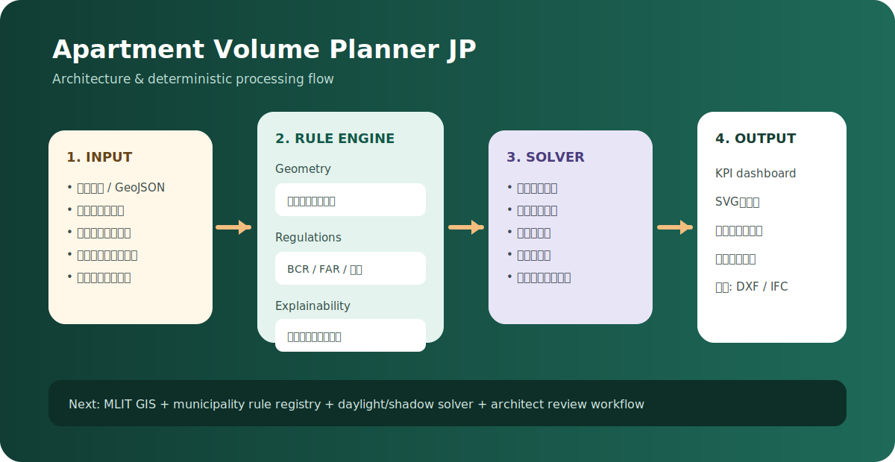
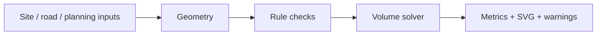

# Apartment Volume Planner JP



日本の共同住宅開発における初期ボリュームチェックを、再現可能な計算と説明付きの法規フラグで支援するWebプロトタイプです。

> **重要**: 本ツールは初期事業検討用です。建築確認、建築士による設計、構造・設備・消防・行政協議を代替しません。

## What it does

- 敷地寸法またはメートル座標GeoJSONから敷地面積を算定
- 建ぺい率、容積率、前面道路幅員係数、高さ、後退距離を反映
- 建築面積、延床面積、階数、賃貸有効面積、概算戸数を計算
- 接道、道路幅員、階段、廊下、自治体条例の要確認事項を表示
- 基準階の概略SVGを生成・保存

## Existing market landscape

| Product | Main strength | Gap this project targets |
|---|---|---|
| ZISEDAI TOUCH&PLAN | Japanese regulation-aware volume and plans; shadow/sky-factor features | Open rule provenance, APIs and extensible jurisdiction registry |
| VC Pro | Fast apartment volume, unit count, rentable ratio and drawing output | Transparent deterministic rule packs and developer-facing architecture |
| ROOK2 | Automatic volume with slant-plane, shadow and sky-factor checks | Web-native evidence and rule lifecycle workflow |
| キボミル | PLATEAU-based 3D regulatory envelope; Tokyo 23 wards | Interior apartment layout and nationwide rule expansion |
| Autodesk Forma | Cloud site planning, generative options and rapid analysis | Japan-specific ordinances and permit-grade evidence |
| TestFit | Multifamily feasibility, parking, unit mix and pro forma | Japanese national/local legal rule system |
| Archistar | Zoning data plus generative feasibility in supported markets | Japanese source coverage and professional review workflow |

Research sources are summarized in `docs/legal-data-strategy.md`; official links are kept in the rule registry and project documentation.

## Architecture



See [`docs/architecture.md`](docs/architecture.md) for the production target, including GIS ingestion, versioned rules, 3D envelope, optimization and BIM handoff.

## Run

```bash
npm ci
npm run dev
```

Then open the forwarded Vite port. For full setup and future production secrets, see [`docs/setup.md`](docs/setup.md).

## Test and build

```bash
npm run check
npm run build
```

GitHub Actions runs type checking, unit tests, production build and uploads the `dist` artifact on push, pull request and manual dispatch.

## Current limitations

- Arbitrary polygons use exact polygon area but a bounding-box approximation for the buildable envelope.
- Slant planes, reverse shadow, sky factor, daylight, evacuation distance, multiple stairs, elevators and structural grids are not yet solved.
- Municipality rules are represented as review gates, not authoritative automated conclusions.
- No cadastral boundary, road designation or official GIS API is fetched in the browser MVP.

## Development sequence

1. Curate Tokyo 23-ward rule packs and benchmark parcels.
2. Integrate MLIT spatial APIs and PLATEAU context.
3. Add 3D envelope and shadow/sky-factor solvers.
4. Add apartment layout optimization and DXF/IFC export.
5. Add qualified reviewer approval, audit trails and rule-change monitoring.

See [`docs/product-roadmap.md`](docs/product-roadmap.md) for acceptance-oriented phases.
