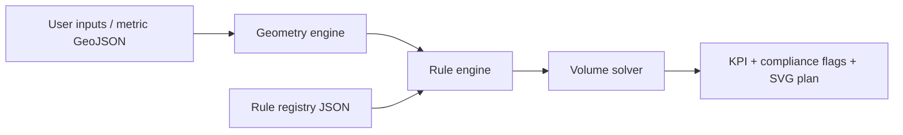
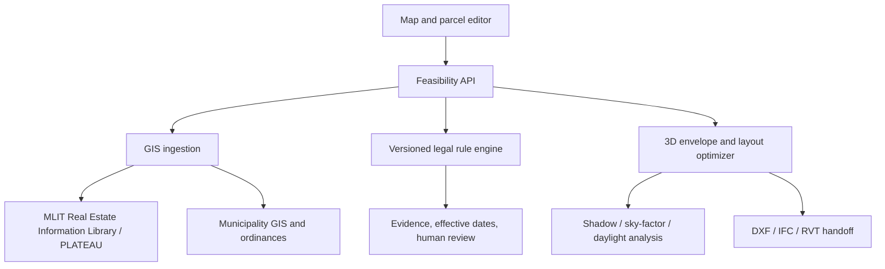

# Architecture

## Current MVP

The browser receives site and planning parameters, then runs a deterministic TypeScript engine. The engine keeps geometry, regulatory checks, and SVG generation separate so each layer can be tested and replaced independently.

## Production target

## Design principles

1. **Deterministic core** — legal and geometric conclusions must be reproducible.
2. **LLM only at the edges** — use language models to extract candidate rules or explain results, never as the sole compliance authority.
3. **Jurisdiction and effective dates** — every rule needs municipality, source, effective date, version, tests, and reviewer status.
4. **Human sign-off** — architect and authority review remains a mandatory workflow gate.
5. **Open formats** — GeoJSON for parcels, JSON for rules, SVG/DXF/IFC for outputs.

## Major future components

- Parcel and road topology service
- Building envelope solver for road, adjacent-lot and north-side slant planes
- Reverse-shadow and sky-factor solver
- Floor-plan optimizer with stairs, elevators, shafts, corridors, daylight openings and evacuation paths
- Cost and rental pro forma
- Rule authoring/review console
- Approval evidence package and change-detection alerts
